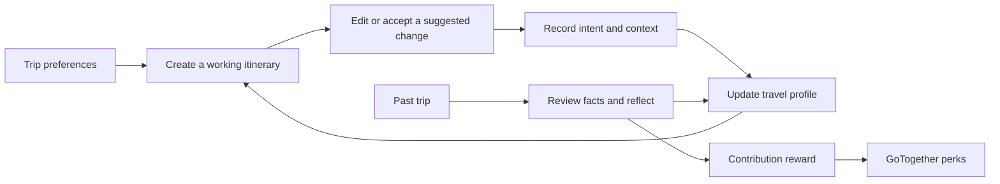

# Travel personalization and learning from itinerary changes

Date: 2026-10-07

Status: R&D proposal. The user selected GoTogether perks, including AI planning credits, as the initial redemption category. Reward amounts below are pilot assumptions. This proposal builds on the current local AI changes and the approved group decision design; these are separate from deployed behavior.

Build a persistent, editable itinerary first, then learn from changes that the traveller actually makes or accepts. Maintain a travel profile that users can inspect and correct, with evidence and context behind each preference. Past trips accelerate learning when users distinguish what they planned, what they did, and what they enjoyed. Rewards encourage useful contributions without turning generated itineraries into an unlimited source of credits.

## Current flow and the missing connections

The current flow is sign in → create a quest → answer the travel wizard → save per-quest preferences → rank catalogue trips → open a day plan → discuss it or request AI notes. The local AI work adds private conversation history, reviewed preference extraction, saved notes, provider validation, and rate limiting.

| Current surface | What it does today | Change needed |
| --- | --- | --- |
| [Travel DNA API](../../../frontend/src/apis/travelDna.ts) | Saves the latest answers for a user and quest | Distinguish trip-specific answers from reusable defaults; record meaningful changes |
| [Recommendation service](../../../backend/src/services/recommendationService.ts) | Filters and scores catalogue trips against accepted members' answers | Resolve each traveller's effective profile before scoring; retain hard limits |
| [Recommendation cards](../../../frontend/src/components/RecommendationCards.tsx) | Holds the selected catalogue ID in component state | Add an explicit Create my plan action that persists a working itinerary |
| [Itinerary story](../../../frontend/src/components/ItineraryStory.tsx) | Displays days and personal notes; supports crew discussion | Add editing, undo, revision history, locks, and explanations for changes |
| [Personalisation service](../../../backend/src/services/personalisationService.ts) | Adds notes while preserving the curated plan | Keep this as narration; introduce a separate structured planning and editing service |
| [Core schema](../../../database/migrations/001_gotogether_core.sql) | Has generic itinerary/activity JSON records | Add stable activity IDs, quest association, revisions, provenance, and edit ownership |
| [Catalogue seed](../../../database/seeds/seedItineraryCatalogue.ts) | Creates 72 template itineraries with synthetic durations, costs, and repeated day descriptions | Add activity-level metadata and label estimated or unknown facts |
| [Profile page](../../../frontend/src/pages/ProfilePage.tsx) | Edits name and country | Add My travel style, evidence, context, correction, and learning controls |
| [Browser storage](../../../frontend/src/services/journeyStorage.ts) | Stores saved places and wizard drafts locally | Synchronize useful saved-place signals with consent; do not treat local bookmarks as server history |

There is no implemented history import, preference-learning pipeline, points ledger, or redemption flow. Generic itinerary CRUD exists, but the current planning UI does not use it as a revisioned trip editor.

Two integration issues must be resolved before collecting richer personal histories:

1. The newly protected AI endpoints coexist with legacy user, itinerary, and travel-service CRUD routes that have no authentication or ownership middleware. This includes user deletion and itinerary updates. Protect or retire these routes before exposing profile/history endpoints; putting new data into generic `users.data` would also expose it through the legacy user reader. See [users](../../../backend/src/routes/users.ts), [itineraries](../../../backend/src/routes/itineraries.ts), and [travel services](../../../backend/src/routes/travelServices.ts).
2. The approved [group decision design](2026-10-06-group-decision-design.md) makes budget and no-go needs private, but the current recommendation DTO includes raw group no-go strings. Separate internal constraint context from the public group response. Do not send private histories or reasons to other crew members.

## Product flow

On the first visit, ask only the information needed to create a usable trip: destination or openness, dates/duration, party, budget, pace, interests, and explicit limits. Offer history import after the first useful plan; it is optional and must not delay planning.

On later visits, show reusable defaults with a question such as “Still your kind of trip?” The current trip can override them. A work trip, solo holiday, and family trip should not all inherit the same pace or accommodation choices.

Use a personal My travel style page for the durable profile. Keep Our Travel DNA focused on the current group's shared plan. A small optional travel-style label can summarize a profile, but editable preferences and their evidence remain authoritative.

## What the travel profile represents

Treat the proposed mindset replica as an evolving model of travel choices. It cannot establish someone's complete personality. Useful dimensions include preferred start time, activities per day, rest intervals, food/culture interests, novelty, accommodation preferences, walking/transfer tolerance, planning flexibility, and spending trade-offs.

Keep three layers:

| Layer | Example | Behavior |
| --- | --- | --- |
| Confirmed defaults | Usually start after 10 a.m. | Reused until changed; the current trip can override a soft default |
| Contextual tendencies | Quieter days when travelling with children | Used only for a compatible trip context |
| Current trip needs | Early airport transfer; fixed budget; mobility requirement | Explicit hard needs take precedence over inferred preferences |

Keep budget amounts, accessibility needs, and dietary restrictions as explicit private inputs. Do not infer diagnoses, income, religion, or other sensitive traits from choices. Store a stated practical requirement only to the extent needed to plan the trip.

Each learned feature records its value, scope, evidence IDs, distinct-trip count, last observation, contradiction count, provenance, and confirmation state. Show “You told us,” “A repeated preference,” or “Still learning.” These labels describe evidence; they are not psychological accuracy percentages.

Example: “You usually prefer later starts on holidays. You chose this on three trips. Correct / This trip only / Forget.” A user correction overrides the inference and survives subsequent recomputation.

Editable natural-language profiles are also an active research direction. A 2026 Amazon paper proposes interpretable preference descriptions that users can modify. That supports the interface choice here, without demonstrating accuracy for GoTogether travellers. [Research on user-controlled profiles](https://www.amazon.science/publications/enabling-user-agency-in-scalable-content-recommendations-with-large-language-models).

## Learning from customization

Every applied edit becomes an event tied to the actual saved revision. Record actor, itinerary, activity, before/after values, source, trip context, optional reason, learning scope, and a request ID. The server computes the diff; the browser cannot submit arbitrary evidence or award values.

| Observed change | Appropriate inference |
| --- | --- |
| Remove a hike because of rain | Change this itinerary; do not infer dislike of hiking |
| Remove a hike and select “I don't enjoy hiking” | Record a negative activity preference in the selected scope |
| Move mornings later across several independent leisure trips | Suggest a preference for later starts |
| Choose a cheaper hotel because the group budget changed | Respect this trip's budget; do not infer permanent frugality |
| Add a cooking class and later say it was a highlight | Strong evidence for that experience category |
| Accept a trip chosen by friends | Record acceptance; do not attribute every activity to that person's taste |
| View an option or leave it untouched | Weak or unknown evidence, not approval or dislike |

Ask “Just for this trip / Remember for similar trips / Make this my default” when the answer would materially change future planning. Keep a lightweight optional reason menu: taste, price, timing, availability, weather, someone else's preference, or other. Avoid interrupting every small edit.

Use simple, inspectable rules for the first version. Confirmed answers and post-trip reflections carry more weight than unexplained edits; clicks carry little. Cap contribution per feature per trip, suppress repeated toggles, and cancel evidence when an edit is undone. Tentative observations decay; explicit active constraints remain until the user changes them. Contradictions lower confidence and can trigger a clarification instead of silently reversing a preference.

This separation is supported by implicit-feedback research: behavior is noisy, and repeated actions provide confidence rather than a direct rating of enjoyment. The proposed weighting rules are product hypotheses to evaluate, not weights supplied by the paper. [Hu, Koren, and Volinsky](https://yifanhu.net/PUB/cf.pdf).

## Making every part of an itinerary editable

Create a user-owned working copy of a catalogue itinerary. The catalogue remains a template. Each day and item gets a stable ID independent of its array position. Items can represent activities, meals, stays, transport, and free time, with local date/time, time zone, duration, location, cost/currency, source, verification state, lock state, and responsible participants where relevant. Unknown facts stay null or explicitly estimated.

Offer Add, Replace, Remove, Move, Change time, Change duration, Change budget, Lock, and Undo. Provide keyboard move controls as well as dragging. Destination/date changes can create a new draft branch when they substantially restructure the trip. Booking amendments remain outside this editor.

The chat route and manual controls use the same edit command contract. “Make day two slower but keep the food tour” should return a preview of affected items, changed cost/time, and preserved locks. The user applies the proposal; the model does not silently replace the entire itinerary.

An example command is `replace_activity` with `itineraryId`, `expectedRevision`, `activityId`, `replacementId`, `reason`, `learningScope`, and `idempotencyKey`. Avoid unrestricted JSON patches from model output. A stale revision returns 409 with a refresh/merge path. Undo creates a new revision and reverses the corresponding learning evidence.

Validate dates, overlapping times, travel buffers, budget totals in a consistent currency, opening hours when known, locks, and explicit participant limits. Manual entries may be incomplete, so distinguish a saved draft with unresolved checks from a validated plan. A hard-constraint conflict cannot be labelled resolved without an explicit change by the person who owns the constraint. Unknown prices or accessibility data cannot pass as verified facts.

Research benchmarks reinforce the need for constraint validation: TravelPlanner studies multi-constraint planning; Flex-TravelPlanner adds changing requirements and priorities over multiple turns. These are architecture lessons, not an assertion about the current accuracy of either configured provider. [TravelPlanner](https://arxiv.org/abs/2402.01622), [Flex-TravelPlanner](https://arxiv.org/abs/2506.04649).

## Recommendation and AI architecture

Resolve effective preferences → filter infeasible candidates → rank activities/trip templates → compose a draft → validate the plan → produce grounded explanations. Preserve a discovery option inside the user's constraints so history does not repeatedly produce the same holiday.

Keep current trip intent dominant. Learned preferences should help choose among feasible options and fill optional defaults, not overrule explicit answers. For group trips, combine each member's effective preferences with the existing group constraints and fairness policy. Another person's edits must never train the whole group's individual profiles.

The candidate/scoring/re-ranking separation follows a common recommendation architecture. Diversity can be handled after relevance scoring. The particular travel features and weighting policy remain GoTogether design choices. [Google recommendation architecture](https://developers.google.com/machine-learning/recommendation/overview/types), [re-ranking](https://developers.google.com/machine-learning/recommendation/dnn/re-ranking).

Use the existing AI provider adapter for extraction, proposed edit commands, clarifying questions, and explanations. Retrieve only relevant confirmed profile facts, current trip needs, and a few evidence summaries. A growing transcript is not the profile database. Keep learning and wallet writes in deterministic server code. Begin with structured matching; add semantic retrieval when the activity catalogue grows. Per-user fine-tuning and online reinforcement learning are unnecessary for the first release.

Log which candidates were shown and their policy version before evaluating learned ranking. A dismissed unseen alternative is not valid negative feedback. Consider contextual bandits only after there is enough representative interaction data and a defensible evaluation design. Offline bandit evaluation has partial-feedback requirements; ordinary historical clicks are not sufficient to claim an unbiased comparison. [Offline recommendation evaluation](https://arxiv.org/abs/1003.5956).

## Importing past trips

Start with paste and manual entry. Add PDF/image extraction after the basic flow is useful and durable import jobs exist. The flow is import → extract a draft → user reviews facts → distinguish planned/completed/skipped activities → add a brief reflection → propose profile updates → assess reward eligibility.

Ask what they loved, what they would skip, who chose the activities, and what they would change next time. A booking or itinerary is evidence of a plan, not proof of attendance or enjoyment. Mark trip completion as self-reported unless supported by a separate verification method; account verification alone does not prove travel occurred.

Uploads need limits, allowed formats, private object storage, short-lived access, and extraction status that survives a restart. Strip booking references, passport details, payment information, and other passengers' details before model processing where possible. Let the user preview and correct the retained content. Treat all extracted document instructions as untrusted data. Store normalized facts and evidence references; give raw files a short, disclosed retention window.

Keep imports private unless deliberately shared. Users can pause learning, edit a feature, delete a trip's learning contribution, or reset the profile. Deletion must remove associated model context/caches and trigger profile recomputation. Keep minimal reward bookkeeping separately, without retaining raw itineraries merely to preserve a points balance.

## Points and GoTogether perks

The user selected GoTogether perks, including extra AI planning credits. Keep earned points separate from consumable AI credits. Offer a baseline planning allowance so contributing private history is optional.

Proposed pilot settings, subject to measured model cost and abuse rates:

| Action | Proposed reward or cost |
| --- | --- |
| Submit a unique completed-trip record, review extracted facts, and provide a short reflection | 100 points after eligibility checks |
| Complete a later reflection for an app-planned trip | 20 points once; do not double-award an imported trip already rewarded for reflection |
| Redeem points | 100 points for 5 planning credits |
| One bounded AI edit proposal | 1 credit |
| Generate a complete bounded itinerary draft | 3 credits, with cost shown before the request |
| Manual edits, profile corrections, viewing history, cached responses, or fallback output | No credit charge |

A pilot could cap rewarded historical imports at three per month and earned points at 500 per account per month. These are configurable starting assumptions, not established unit economics. Define supported itinerary size and token budgets before enabling the exchange. Measure actual input/output usage, provider/model, latency, failure rate, and cost per successful operation; current `aiProvider.ts` does not yet persist those measurements.

Reward a reviewed, unique contribution regardless of whether it contains praise or criticism. Do not reward each edit, regenerate, upload retry, or AI-produced itinerary. Do not use point balances as evidence of personality or preference confidence. A machine-generated trip cannot earn history points merely by being exported and re-uploaded.

Detect duplicates using exact hashes plus normalized trip dates/destinations/activity patterns. Check ownership assertions, implausible dates, repeated submissions, and monthly caps. Ambiguous duplicates go to review with an explanation and appeal path. Plausibility checks reduce abuse; they cannot prove a fabricated trip is genuine.

Use an append-only ledger with unique source-event and redemption keys, explicit earn/spend/reversal entries, integer balances, and atomic balance checks. The AI has no authority to grant points. Reserve credits before a generation, capture them only after valid output is persisted, and release reservations on timeout/fallback/failure. Cached results do not consume credits. Client retries resolve to the same generation and charge. Keep rate limits even when a user has credits.

Do not hold a database transaction open during the model call. Use a durable generation/reservation record so a restart cannot strand credits. Redemption and result finalization must be atomic. PostgreSQL row locks can serialize balance changes; Supabase can expose the same database functions through RPC. Restrict these functions to the backend role, with ownership checks and no anonymous execute access. Existing app sessions are not Supabase Auth identities. [PostgreSQL locks](https://www.postgresql.org/docs/current/explicit-locking.html), [Supabase functions](https://supabase.com/docs/guides/database/functions).

## Data and service changes

Reuse Express, PostgreSQL/Supabase, and the shared AI adapter. Add the data structures in phases rather than introducing a separate ML service immediately.

| Structure | Responsibility |
| --- | --- |
| Extend `itineraries` | Owner, optional quest, catalogue origin, current revision, lifecycle status, structured working plan |
| `itinerary_revisions` | Immutable accepted snapshots/commands; actor and unique request ID; unique itinerary/version |
| `preference_events` | Private, deduplicated observations with source revision/import, context, scope, reason and reversal state |
| `travel_profiles` | Versioned, rebuildable feature projection with confirmed overrides and learning settings |
| `travel_imports` | Source fingerprint, reviewed facts, processing status, completion status and reward eligibility |
| `activity_catalogue` | Stable alternatives with source, location, duration, cost currency, interests and constraint metadata |
| `reward_accounts` and `reward_ledger` | Points/credits balances, reservations and immutable entries with unique action keys |
| `ai_generations` | Idempotent job status, reservation, saved output, usage, cache identity and failure recovery |

Write accepted revision + preference event in one transaction. Persist a projection checkpoint so profile computation can be replayed safely; recomputation must honor reversals, deletion, and user overrides. Save the profile version used to generate each recommendation for traceability. Do not make an edit disappear because optional profile summarization failed.

Current `storage.ts` has individual row operations, not a multi-operation transaction/RPC abstraction. Add explicit transactional functions and exercise both providers. Use a checked-out `pg` client for multi-statement transactions, or one database function shared with Supabase RPC; independent pool queries do not establish a transaction across requests.

Initial API contracts:

- `POST /api/quests/:roomId/working-itineraries`: create a saved copy from a catalogue ID or a validated draft.
- `GET /api/working-itineraries/:id`: return the authorized current revision.
- `POST /api/working-itineraries/:id/proposals`: propose a bounded change without applying it.
- `POST /api/working-itineraries/:id/changes`: apply validated operations using expected revision and idempotency key.
- `POST /api/working-itineraries/:id/undo`: create a reversal revision and reverse learning evidence.
- `GET/PATCH /api/me/travel-profile`: read/correct features and learning settings; reject client-supplied confidence or evidence weights.
- `POST /api/me/travel-imports` and `POST /api/me/travel-imports/:id/confirm`: separate ingestion from reviewed acceptance.
- `GET /api/me/rewards` and `POST /api/me/rewards/redemptions`: read the ledger and redeem through an atomic server action.

## Group decision compatibility

The approved group decision design specifies quick answers, private hard limits, member fits, and voting. Feed effective personal preferences into that flow; avoid creating a second competing group scorer. Keep established quick-answer meanings, including Flexible budgets, consistent across both paths.

A group's acceptance must refer to a specific working itinerary revision. Substantial changes after acceptance create a new proposal and require renewed agreement. For the first editor release, the owner applies shared changes and members propose changes or make personal copies. Later collaborative editing can add explicit editor permissions. Guest sessions remain trip-scoped until an explicit account-linking flow exists.

The local AI migration is `004_ai_records.sql`; the group design also proposes a migration numbered `004`. Reconcile filenames and ordering before implementation, preserve any already-applied migration, and allocate new versions after the group changes. Its build plan also sketches a provider implementation; reuse the current `aiProvider.ts` instead of adding another provider-selection path.

## Delivery sequence and acceptance

| Phase | Deliverable | Acceptance evidence |
| --- | --- | --- |
| 0 | Integrate the existing local AI changes, reconcile group design contracts/migrations, protect legacy CRUD, separate private/public DTOs | Authorization tests deny cross-user access and deletion; private constraints never appear in shared responses |
| 1 | Persistent working itinerary and manual editor | Create → replace/move/lock → reload → undo works; concurrent stale edits cannot overwrite changes; an accepted group revision cannot silently change |
| 2 | Travel profile with scoped evidence | A confirmed preference affects a later matching trip; a weather change does not; repeated toggles and another member's edits do not inflate confidence |
| 3 | AI edit proposals and plan validation | Apply only the previewed changes; preserve locks and unrelated items; handle changing constraints; display unknown facts; retain manual editing on AI failure |
| 4 | Reviewed past-trip import and reflection | Correct extraction before saving; duplicates cannot mint rewards; deleting evidence updates the profile; malformed/private documents stay contained |
| 5 | Points ledger, usage metering and credits pilot | Concurrent redemptions cannot overspend; retry cannot double-charge; fallback releases credits; restart recovery reconciles outstanding reservations |

The first complete demonstration should be: choose a five-day trip → save it → replace a sunrise activity → explicitly remember a later-start preference → reload → create another leisure trip whose initial draft respects that preference. Separately, undo an unconfirmed edit and verify its learning evidence is reversed. A third test uses the same edit with “weather” and proves no durable personality change.

Measure plan acceptance, accepted AI proposals, reason-coded corrective edits, constraint violations, time to a satisfactory plan, profile corrections, and post-trip satisfaction. Raw edit count can rise because customization is enjoyable, so fewer edits alone is not success. Track import completion, duplicate rejection, points issued, redemption, and model cost alongside user value.

Use deterministic synthetic regression cases first, then temporal user-level evaluation and a small opt-in pilot against the current preference-only baseline. Evaluate solo/family/work contexts and sparse-history users separately. Choose pilot thresholds after baseline measurement; do not promise a personalization uplift or a personality accuracy score in advance.

## Decisions established and still open

Established: the intended flow learns from customization and past trips; initial redemption is GoTogether perks/AI credits; users retain control of their travel profile.

Proposed for the first build: editable saved itineraries, explicit reusable preferences, owner-applied group changes, paste/manual history import, and no per-user model training. Point amounts, exact credit costs, source retention, import eligibility review, activity-data sourcing, and rollout targets remain configurable product decisions. External travel vouchers, paid credit purchases, live booking and automatic booking changes are later scopes.
