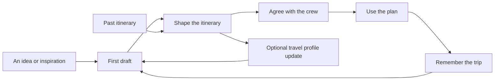

# Trip planning workflow and interaction design

Date: 2026-10-07

Status: proposed UX direction for review. Complements the [personalization design](2026-10-07-travel-personalization-design.md) and [approved group decision design](2026-10-06-group-decision-design.md). Anonymous organizer drafts and deferred account creation below extend the approved signed-in organizer flow; they are proposed additions, not implemented behavior.

Make a useful trip visible early, then let people shape it in one persistent workspace. The main interaction is choosing and arranging experiences. Short questions appear where their answers change the plan. Chat helps express complex wishes, and ordinary controls handle precise changes. Users can always see their trip, their progress, and what will happen next.

## Friction in the current journey

The current [route guard](../../../frontend/src/components/AppShell.tsx) requires authentication before quest creation. [CreateRoomPage](../../../frontend/src/pages/CreateRoomPage.tsx) then requires a quest name before [QuestionsPage](../../../frontend/src/pages/QuestionsPage.tsx) presents four stages covering dates, duration, companions, budget, moods, pace, and optional details. It saves a browser draft, but a usable plan comes after the questionnaire.

[QuestDetailPage](../../../frontend/src/pages/QuestDetailPage.tsx) already brings recommendations and crew chat together. However, the private Companion is below the recommendations and itinerary; its shortcut scrolls there. Preference editing and group DNA take users to separate routes. [RecommendationCards](../../../frontend/src/components/RecommendationCards.tsx) keeps the selected option in component state, and [ItineraryStory](../../../frontend/src/components/ItineraryStory.tsx) displays days without activity editing.

The most valuable change is to shorten the distance between expressing an idea and manipulating a plan. Replacing every field with a chat question would still demand the same work, while making precise corrections harder.

## A continuous journey

These are lifecycle states, not a compulsory sequence of screens. Solo travellers skip agreement. Invited friends land in the existing workspace. Returning users resume their last active day and panel. Importing a plan bypasses the initial discovery questions.

Use an editable trip title and a small state label such as Draft, Reviewing together, or Agreed. These describe the plan; they are not profile-completion scores or booking confirmations.

## Start with an idea

The main entry asks, “What kind of trip are you imagining?” A traveller can type “Four relaxed days in Goa with friends, good food and no early starts,” select an inspiration card, or choose Help me decide. Import an existing plan is a secondary entry. Text is optional: the same intentions can be expressed with labelled choices.

Extract what the traveller already supplied and reflect it back as editable chips: Goa, Four days, Friends, Slow mornings. Distinguish explicit information from tentative interpretation. A group phrase supplies a draft suggestion; it cannot set every member's private preferences.

Ask only a missing detail that materially changes the next suggestion. Duration can use Weekend, A few days, or Decide later. Unknown dates stay flexible; unknown budgets stay unspecified. Offer a visible My needs control for practical constraints throughout planning. Never infer dietary, accessibility, or budget limits from imagery or silence.

Let Show me a starting point remain available. With little information, show clearly labelled example plans or two to three directions to compare. Do not call that draft fully personalized or validated. Preserve uncertainty rather than inventing precise dates, prices, availability, or transport times.

Generate the trip name from known context, such as Our Goa escape; allow renaming in place. Invite people after there is something meaningful to share. Country, travel personality quizzes, full profile completion, and history imports do not gate this first draft.

For a later release, allow a bounded draft in this browser before asking for an account. Ask to sign in when users want cross-device saving or sharing, explain that purpose, and restore the exact draft after authentication. Show the browser-only persistence boundary before sign-in. This needs a draft transfer contract; removing the route guard alone is insufficient. Existing authenticated APIs remain protected. Anonymous AI requests, if introduced, require separate limits; the initial preview can use catalogue data without model calls.

## The trip workspace

Keep one canonical workspace per quest. It has a compact header containing editable destination, date/duration, travellers, a clearly scoped budget summary, save status, and Share. When amounts exist, show currency and whether they are per person or group totals. Missing prices remain visible as unknown, not zero.

On a wide desktop, use the main area for a chronological itinerary and one optional side panel. The panel can show Ideas, Companion, or Crew. Keep these entry points visible even when the panel is closed; keep private and shared messages separate. A plan/map toggle changes the main view while preserving the selected day and activity. Avoid showing a map, idea library, two chats, and the plan in four narrow columns at once.

| Surface | Primary content | Secondary detail |
| --- | --- | --- |
| Trip header | Destination, timing, people, save state | Rename, full preferences, activity history |
| Day timeline | Time, experience, location, duration, cost state | Practical notes, source details, alternatives |
| Ideas panel | Relevant experiences and saved ideas | Search and filters |
| Companion panel | Private help about the selected trip/day/item | Explain a suggestion, learning controls |
| Crew panel | Shared discussion, proposals, agreement | Member participation and invitation controls |

Cards should have clear types for experiences, meals, stays, transfers, and free time. Use destination photographs selectively, quiet paper textures, restrained travel stamps, and legible icons with labels. Keep backgrounds calm beneath text and controls. A canvas can feel tactile while preserving a predictable reading order; it does not need infinite panning or floating objects.

On mobile, use one day-focused timeline, a compact day selector, and a persistent Plan / Ideas / Companion / Crew navigation. Each panel opens as one sheet with an obvious return to the selected day. Account for the keyboard and device safe areas so the message composer and Apply action remain reachable. The map is an optional view, not a permanent background behind small cards.

## Editing the plan directly

Expose a few common actions on each item: Replace, Move, and a labelled More menu for timing, lock, and removal. Add between items, rather than requiring users to find a global editor. Keep manual entry for an activity that is absent from the catalogue.

| Intention | Interaction | Feedback |
| --- | --- | --- |
| Reorder a day | Drag using a visible handle | Insertion line and resulting order |
| Move between days | Drag to a day target or choose Move to day | Destination day and any timing conflicts |
| Add a saved idea | Drag from Ideas or tap Add to day | Placement preview, known cost and duration |
| Replace an activity | Tap Replace and compare a few options | What changes and what stays fixed |
| Change pace | Tap a day-level Slow this day down action | Preview of suggested removals or moves |
| Protect a favourite | Lock the item or its time | Explicit indication of what is locked |
| Remove something | Choose Remove | Immediate Undo and persistent history |

Dragging must not be the only way to act. Provide tap/click Move to day and Move earlier/later controls, plus full keyboard operation and screen-reader announcements. Keyboard support alone does not satisfy the single-pointer alternative to dragging. This is grounded in [W3C guidance on dragging movements](https://www.w3.org/WAI/WCAG22/Understanding/dragging-movements).

On touch devices, preserve normal vertical scrolling; activate dragging through the handle, with a movement threshold and clear picked-up state. Cancellation and dropping outside a valid target restore the original position. Do not require dragging across several screens to reach another day. Locked targets explain the restriction and provide a deliberate unlock action.

An order change cannot silently move a fixed-time reservation. Show the resulting schedule before committing changes that alter other items. Known impossible placements should explain why and offer a feasible slot or Keep unscheduled. Unknown opening hours or transfers remain unresolved checks. Only feasible, validated changes can contribute to a plan marked ready; saving an incomplete draft remains possible.

## Companion and crew within reach

Keep an always-visible Ask Companion action beside the itinerary controls. Selecting an activity and choosing Ask about this opens the private panel with that activity attached. Show and allow removal of the attachment. Preserve the selected item and scroll position when closing the panel.

“Make tomorrow slower but keep the food tour” produces a compact change preview: the items affected, the known time/cost difference, and preserved locks. Users can apply or dismiss it. The applied changes appear on the itinerary with Undo. Do not replace the entire plan or immediately move focus away from the result.

The same workspace exposes Crew with unread status. Label Companion as Private and Crew as Shared. Sending to one must never silently send to the other. Sharing a private suggestion should be an explicit previewed action; importing crew messages into an AI request remains an explicit choice.

Offer action suggestions based on context, such as Find a nearby lunch or Compare these stays. Keep free text for nuanced requests. Avoid a compulsory conversational interview. Easy invocation, dismissal, and correction are supported by [Microsoft's human and AI interaction guidelines](https://www.microsoft.com/en-us/research/articles/guidelines-for-human-ai-interaction-eighteen-best-practices-for-human-centered-ai-design/); the particular panel layout remains a GoTogether design hypothesis.

## Transitions and continuity

| Transition | Intended behavior |
| --- | --- |
| Idea to draft | Keep the destination/title visible while the workspace appears; reveal real content as it is ready |
| Day selection | Preserve the workspace shell; move focus and scroll to the chosen day predictably |
| Open an item or panel | Expand near the selected context; return focus to the trigger on close |
| Apply a change | Briefly emphasize changed items; leave unrelated items and scroll position stable |
| Sign in | Preserve the draft before redirecting; resume the same task after success |
| Return later | Restore the saved plan revision, active day, and applicable view |
| New crew proposal | Show a notification and preview; do not reorder the active plan underneath someone |

Use short motion, initially around 150–220 ms, as a design value to test. Animation must not impose a minimum wait on a completed operation. With reduced-motion preferences, use immediate state changes or subtle fades and retain all feedback. [W3C animation guidance](https://www.w3.org/WAI/WCAG22/Understanding/animation-from-interactions.html).

Keep generated-content loading local to the panel or proposal. Let users inspect and manually edit the existing plan during an AI request. Show accurate request states rather than invented percentages or a staged progress show. Cancellation or retry must not apply a stale response to a newer revision.

## Recovery without losing momentum

Saving should say Saving, Saved, or Changes pending on this device, based on the actual persistence state. Browser storage is not guaranteed; handle its failure and never claim success before it occurs. Queue only supported local edits, and revalidate their base revision before synchronizing. Scope private drafts to the account and make logout/account-switch behavior explicit.

An AI failure retains the plan and opens relevant manual actions. A rejected save preserves the user's attempted change for retry. A concurrent edit offers Review latest and Reapply instead of silently overwriting. Undo remains available in history after a transient notification disappears.

If no option fits, show which requirement needs attention, without exposing another member's private reason. Offer a different date, nearby location, or manual idea where appropriate. Explicitly obtain the relevant person's decision before changing a hard constraint. Keeping momentum does not mean hiding unresolved conflicts.

## Learning without another questionnaire

After a meaningful accepted change, occasionally show an optional inline prompt: “Later starts for future holidays too?” The edit already succeeded; this prompt never gates it. Offer Remember for similar trips and Just this trip. Dismissing it is not permission to store a confirmed default. Honour the person's learning setting for any tentative evidence, and avoid repeated prompts in the same session.

The travel profile summarizes explainable preferences and allows corrections. It is available from the account menu and contextual prompts, not inserted between itinerary steps. Do not add a required personality quiz or a profile-completion percentage.

Past-trip import lives in My trips as Add a past trip. Paste first, then show extracted days as reviewable cards. Ask what actually happened and what the person would repeat through brief reactions and optional notes. Completing an import should not require retyping correctly extracted fields, but uncertain dates or ownership still need clarification before reward eligibility. An uploaded document is not proof that a trip happened.

Keep points and credits in a small rewards area. Award confirmation comes after contribution review; manual editing stays available if credits run out. Show AI operation cost before requesting it, with no charge for failed/fallback output under the proposed rewards policy. Avoid putting an upsell, upload demand, or reward animation between a user and their plan.

## Group planning and privacy

Build on the approved guest-link and private-needs design. An invited friend sees the existing plan, can use quick choices for their own preferences, and reviews a proposed itinerary revision. Explain who can see each kind of input. The organizer does not need to wait for every guest before exploring or drafting.

Display participation honestly: Two of four travellers have shared preferences is different from Everyone agrees. The approved voting policy considers members with saved answers; present agreement as Among participating travellers when other members have not answered. Do not silently change that policy through UI wording.

In the initial editor, the owner applies shared changes; other members propose changes or edit a personal copy. Acceptance belongs to the revision reviewed. Material changes reopen review. Personal memories and reasons stay private, and an organizer's edit cannot train everyone else's profile.

## Implementation sequence

Progressive disclosure separates frequent controls from secondary details, while keeping the latter discoverable. This supports the workspace approach for tightly related planning decisions. It does not mean hiding safety-relevant requirements. [Nielsen Norman Group on progressive disclosure](https://www.nngroup.com/articles/progressive-disclosure/).

1. Prototype the trip workspace with representative data: short entry, a plan, a replacement, drag and tap movement, contextual chat, and undo. Test desktop and mobile before broad screen replacement.
2. Build the persistent editor and revision contracts from the personalization design. A visually convincing editor must survive reloads and concurrent changes.
3. Replace the compulsory create/name and four-stage wizard path with a short entry and contextual preferences. Keep full preferences available for deliberate detailed input, and preserve old links with redirects or equivalent views.
4. Move Companion into the persistent contextual panel and connect reviewed AI edit proposals to the editor. Integrate guest participation and revision-aware agreement.
5. Add scoped learning prompts, reviewed history import, and the points/credit flows. Introduce anonymous organizer drafts only with reliable authentication handoff and abuse controls.

Reuse existing route and component boundaries where useful: QuestDetailPage becomes the workspace shell, ItineraryStory becomes the editable timeline, RecommendationCards feeds discovery and alternatives, CompanionPanel gains explicit selected-item context, and QuestionsPage becomes an optional preferences surface. Persist selected itinerary and day context instead of relying on component state. All manual and AI edits use the same authenticated, validated command service.

The new UX must be tested as a whole journey: start without knowing exact dates; create a useful draft; move an item using touch and keyboard; find and use Companion; distinguish private and shared chat; recover after reload, authentication, AI failure, and a save conflict; leave and return without losing context. Include a group member who has not answered yet and a plan with no feasible alternative.

Measure time to a useful draft, completion of a chosen edit, successful recovery, chat discovery, accidental actions and undo, and perceived effort. Compare against the existing wizard with representative new and returning travellers. These are evaluation measures, not a promise of a specific conversion uplift. The first prototype should establish whether users can shape a trip without being taught the interface.
